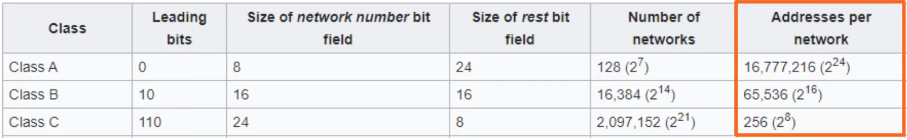

IPv4 addressing operates in the 3rd layer of the OSI model stack - the Network layer.
* Provides connectivity between end hosts on different networks (ie. outside of the LAN).
* Provides logical addressing (IP addressing).
* Provides path selection between source and destination.
* Routes operate at Layer 3.
* The length of IP addresses is 4 bytes (32 bits).


## IPv4 Address Classes
IPv4 addresses are divided into five different classes. The class of the IPv4 address is determined by the first octet of the IP address.


The non `x` values in the first octet indicate the first possible IP address for the given IPv4 address class. Setting all remaining `x` to 1 indicate the last possible IP address. Therefore, all addresses between the first and last possible addresses are available for use.

* Only Classes A, B, and C can be assigned to devices.
* IPv4 class D addresses are multicast addresses.
* IPv4 class E addresses are Reserved (experimental purposes).
* For class A IPv4 addresses,  the first and last addresses are reserved. Therefore, the usable addresses are in the range 1 - 126. The 127 address range is reserved for Lookback addresses.
	* The address range is 127.0.0.0 - 127.255.255.255.
	* It is used to test the 'network stack' (OSI, TCP/IP model) on the local device.
	* When a host sends network traffic in the mentioned address range, the traffic is simply processed back up the network model stack.



## Maximum Hosts per Network
Every network contains a network and broadcast addresses that cannot be used.
* Suppose we have the address `192.168.1.0/24`
	* The network address is `192.168.1.0/24`
	* The broadcast address is `192.168.1.255/24`
	* The first usable address is `192.168.1.1/24`
	* The last usable address is `192.168.1.254/24`

$$
Maximum\ hosts\ per\ network = 2^n - 2, n = number\ of\ host\ bits
$$

## Netmask (Notation used by Cisco to denote IP class)
* Class A: /8  --> 255.0.0.0
* Class B: /16 --> 255.255.0.0
* Class C: /24 --> 255.255.255.0

## Configure Router


* `administratively down (status)`: Interface has been disabled with the `shutdown` command
	* This is the default  status for Cisco router interfaces
	* Cisco switch interfaces are not administratively down by default.
* `Method`: Method by which the interface was assigned an IP address. 
* `Protocol`: Because the interfaces at layer 1 are down, layer 2 cannot operate.
	* You will never see an interface with a `down` status and `up` in the protocol column. Although, the reverse is possible.
#### Assign IP and Subnet Mask to router interface
```
R1#configure terminal
R1(config)#interface [interface]
R1(config-if)#ip address 10.255.255.254 255.0.0.0
R1(config-if)#no shutdown
```

#### Other Commands
`R1#show interfaces [interface]`
* Shows information primarily about the layer 1 and 2 of the interface, but also some layer 3.

`R1#show interfaces description`
* Displays interfaces, status, protocol, and description. Descriptions are optional, but can be useful in identifying the purpose of each interface.