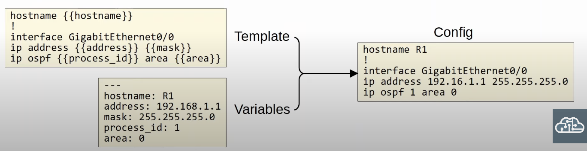
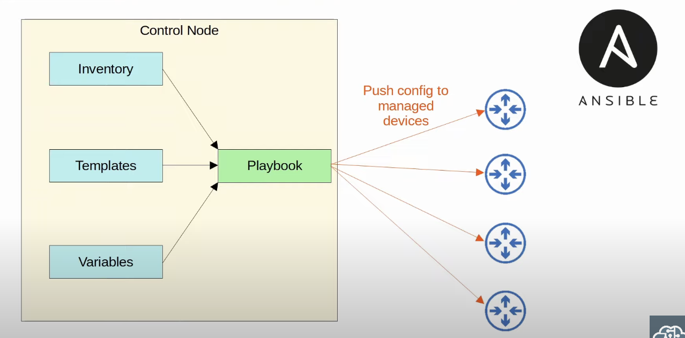
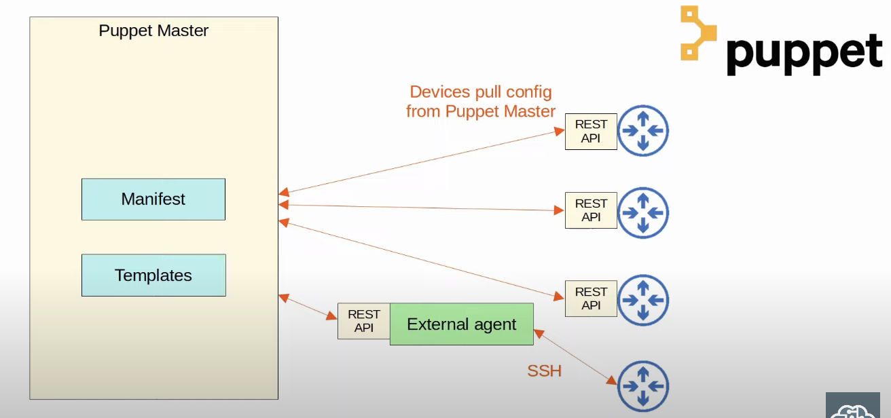
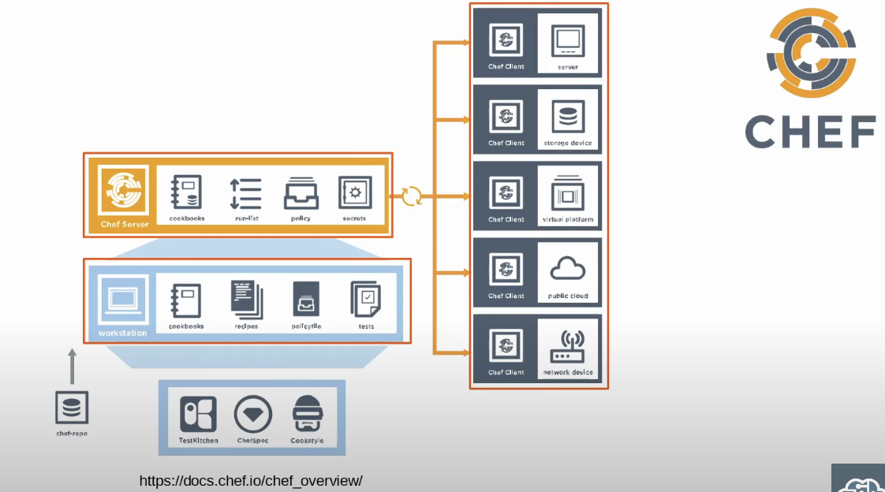
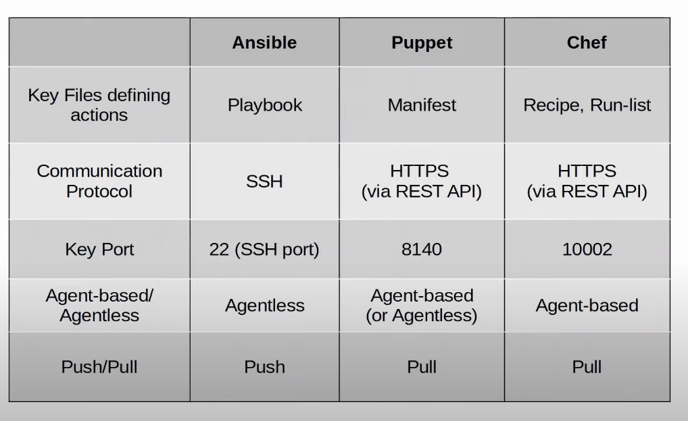

## Configuration Drift
* *Configuration drift* is when individual changes made over time cause a device's configuration to deviate from the standard/correct configurations as defined by the company.
	* Although each device will have unique parts of its configuration (IP addresses, host name, etc),
	* Most of the device's configuration is usually defined in standard templates designed by the network architects/engineers of the company.
	* As individual engineers make changes to devices (for example to troubleshoot and fix network issues, test configurations, etc.), the configuration on a device can drift away from the standard.
	* Records of these individual changes and their reasons aren't kept, which can lead to future issues.
* Even without configuration tools, it is best to have standard *configuration management* practices.
	* When a change is made, save the configuration as a text file and place it in a shared folder.
		* A standard naming system like *hostname_yyyymmdd* might be used.
		* There are flaws to this system, as an engineer might forget to place the new config in the folder after making changes. Which configuration should be considered the 'correct' config ?
		* Even if configurations are properly saved like this, it doesn't guarantee that the configurations actually match the standard.
		* Furthermore, a manual approach is not very scalable in networks with hundreds of devices.
## Configuration Provisioning
* *Configuration provisioning* refers to how configuration changes are applied to devices.
	* This includes configuring new devices, too.
* Traditionally, configuration provisioning is done by connecting to devices one-by-one via SSH.
	* This is not practical is large networks.
* Configuration management tools like Ansible, Puppet, and Chef allow us to make changes to devices on a mass scale with a fraction of the time/effort.
	* Two essential components that you'll find in all of these tools are templates and variables.

* Given a template and the appropriate variables, a config is generated and sent to the device.
* It facilitates the configuration of many devices at once.
	* All devices can share the template and we just need to specify some variables like hostnames, Ip addresses, etc.
* Exactly how these templates and variables are managed is different depending on the tool, but they all use a system like this.
## Intro to Configuration Management Tools
* Configuration management tools are network automation tools that facilitate the centralized control of large numbers of network devices.
* Configuration management tools can help prevent configuration drift and also assist in configuration provisioning.
* The options you need to be aware of for the CCNA are Ansible, Puppet, and Chef.
* These tools were originally developed after the rise of VMs, to enable server system admins to automate the process of creating, configuring, and removing VMs.
	* However, they are also widely used to manage network device.
* These tools can be used to perform tasks such as:
	* Generate configurations for new devices on a large scale.
	* Perform configuration changes on devices (all devices in your network, or a certain subnet of devices).
	* Check device configuration for compliance with defined standards.
	* Compare configurations between devices, and between different versions of configurations on the same device.
### Ansible
* Ansible is a configuration management tools owned by Red Hat.
* Ansible itself is written in Python.
* Ansible is agentless.
	* It doesn't require any special software to run on the managed devices.
* Ansible uses SSH to connect to devices, make configuration changes, extract information, etc.
	* This is a big advantage of Ansible which makes it very versatile, and it's probably the reason that it is the most popular choice for network device configuration management.
* Ansible uses a push model. The Ansible server (Control node) uses SSH to connect to managed devices and push configuration changes to them.
	* Puppet and Chef use a *pull* model, where the managed devices connect to the server to receive their configurations.
* After installing Ansible itself, you must create several text files:
	* **Playbooks**: These files are 'blueprints of automation tasks'. They outline the logic and actions of the tasks that Ansible should do. Written in YAML.
	* **Inventory**: These files list the devices that will be managed by Ansible, as well as characteristics of each device such as their device role (access switch, core switch, WAN router, firewall, etc). Written in INI, YAML, or other formats.
	* **Templates**: These files represent a device's configuration file, but specific values for variables are not provided. 
		* Written in Jinja2 format.
	* **Variables**: These files list variables and their values. These values are substituted into the template to create complete configuration files. Written in YAML.

### Puppet
* Puppet is a configuration management tools written in Ruby.
* Communication is done HTTPS via REST APIs.
* Puppet is typically agent-based.
	* Specific software must be installed on the managed devices.
	* Not all Cisco devices support a Puppet agent.
* It can be run agentless, in which a proxy agent runs on an external host, and the proxy agent uses SSH to connect to the managed devices and communicate with them.
* The Puppet server is called the 'Puppet master'.
* Puppet uses a pull model (clients pull configuration from the Puppet master).
	* Clients use TCP 8140 to communicate with the Puppet master.
* Instead of YAML, it uses a proprietary language for files.
* Text files required on the Puppet master include:
	* **Manifest**: This file defines the desired configuration state of a network device.
	* **Templates**: Similar to Ansible templates. Used to generate Manifests.

### Chef
* Chef is a configuration management tools written in Ruby.
* Communication is done HTTPS via REST APIs.
* Chef is agent-based.
	* Specific software must be installed on the managed devices.
	* Not all Cisco devices support a Chef agent.
* Chef uses a pull model.
* The server uses TCP 10002 to send configurations to clients.
* Files use a DSL (Domain-Specific Language) based on Ruby.
* Text files used by Chef include:
	* **Resources**: The 'ingredients' in a recipe. Configuration objects managed by Chef.
	* **Recipes**: The 'recipes' in a cookbook. Outline the logic and actions of the tasks performed on the resources.
	* **Cookbooks**: A set of related recipes grouped together.
	* **Run-list**: An ordered list of recipes that are run to bring a device to the desired configuration state.

## Ansible, Puppet, Chef Comparison

* These three configuration tools us a client-server model.