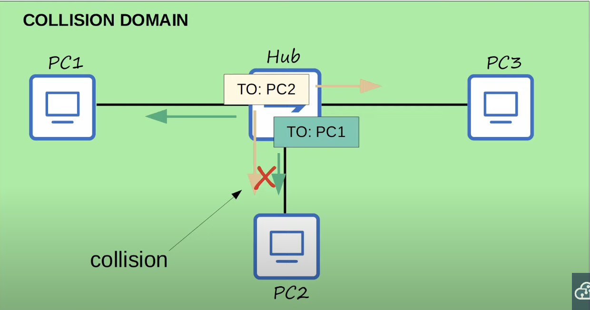
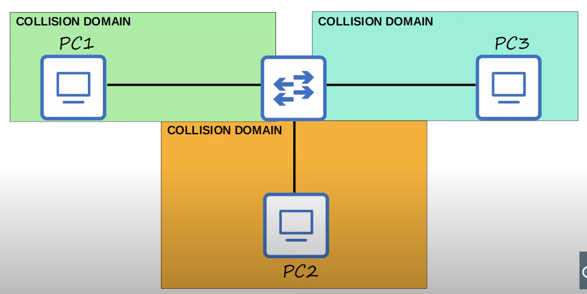
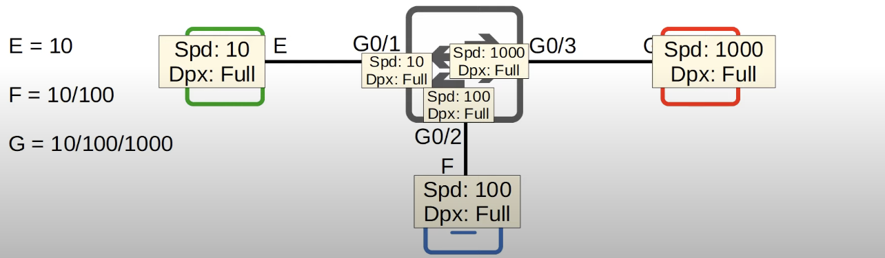
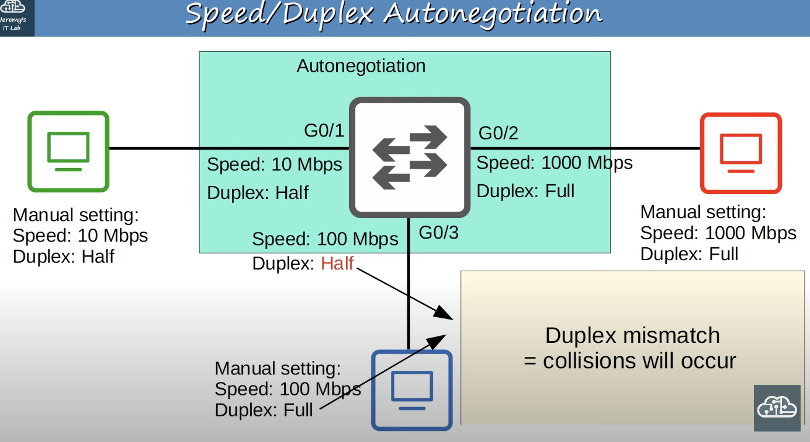
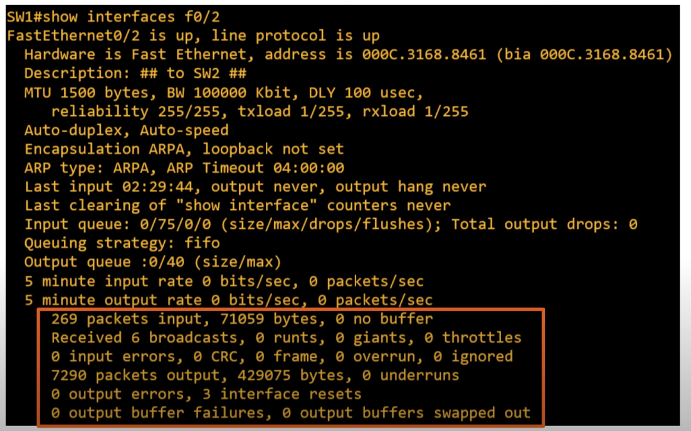

## Switch Interfaces Default Status
```
SW1>enable
SW1#show ip interface brief
Interface       IP-Address     OK?     Method     Status    Protocol
FastEthernet0/1 unassigned     YES     unset      up        up
FastEthernet0/2 unassigned     YES     unset      down      down
```

* Router interfaces have the `shutdown` command applied by default.
	*  Will be in the `administratively down/down (status/protocol)` state by default.
* Switch interfaces do not have the `shutdown` command applied by default.
	* Will be in the `up/up(status/protocol)` state if connected to another device.
	* Will be in the `down/down` state if not connected to another device.
	* Having switch interfaces enables by default can be a security concern, therefore they should be disabled.

```
SW1#show interfaces status
Port   Name     Status         Vlan    Duplex     Speed   Type
Fa0/1           connected      1       a-full    a-100    10/100BaseTX
Fa0/2           notconnected   1       a-full    auto     10/100BaseTX
Fa0/3           disable        1       a-full    auto     10/100BaseTX
```
* **Name** field is the interface description.
* **Duplex** indicates whether the device is capable of sending and receiving data at the same time.
	* Duplex is auto by default on Cisco switches. It will negotiate with the connected device and use full-duplex if possible.
	* a-full means that full-duplex was automatically negotiated with the device and the interface it is connected to in the switch.
* **Speed** is negotiated automatically by default. The interfaces shown above are fast ethernet interfaces so they are capable of speeds of 10 Mbps and 100 Mbps.
	* The switch will automatically negotiate the speed and pick the highest speed possible by both, the device and the interface that it is connected to.
	* a-100 in this case means that a speed of 100 Mbps was automatically negotiated between the device and the interface it is connected to. 
* **Type** indicates the type of interfaces.
	* In this case they all are RJ-45 interfaces that support 10 Mbps and 100 Mbps.
	* They could also be SFP (small form-factor pluggable) for fiber standards.
Auto negotiation usually works well for the interfaces. Therefore, most of the time they will remain that way

## Interface Range Configuration
It is possible to configure multiple interfaces at the same time.
```
SW1(config)#interface range f0/5 - 12
SW1(config-if-range)#shutdown // interfaces f0/5 - 12 will be shut down
```
The interfaces in the range do not have to be consecutive
```
SW1(config)#interface range f0/5 - 6, f0/9 - 12
SW1(config-if-range)#no shutdown
```

## Full/Half Duplex
* **Half duplex**: The device cannot send and receive data at the same time. If it is receiving a frame, it must wait before sending a frame.
* **Full duplex**: the device can send and receive data at the same time. It does not have to wait.
	* Full duplex is the preferred way to go. 
	* Devices attached to a switch can operate in full duplex.

#### Where is Half Duplex Used
In modern day networks, half duplex is almost never used.

In the example above, PC1 and PC3 that are sending frames at the same time. PC1 is communicating with PC2 and PC3 is communicating with PC1. 
When the frames from both hosts arrive at the hub, it will try to flood both of them at once, resulting in a collision on the interface communicating with PC2. As a result, PC2 wont receive either frame intact.
* All hosts connected to a hub are part of the same collision domain. The frames sent by one host could collide with the frames sent by other hosts connected to the same hub.

## Half Duplex Collision Resolution
#### CSMA/CD (Carrier Sense Multiple Access with Collision Detection)
It describes how devices avoid collisions in a half duplex situation and how to react in case of a collision.
* Before sending frames, devices listen to the collision domain until they detect that other devices are not sending.
* If a collision does occur (bad timing, etc..), the device sends a jamming signal to inform the other devices that a collision happened.
	* Each device will wait a random period of time before sending frames again.
* The process repeats.

## Collision Domain

#### Switches vs Hubs
Hubs are simple repeaters which operate at layer 1, repeating whatever signals they receive. Switches operate at layer 2, using layer 2 addressing, MAC addresses to send frames to specific hosts. Furthermore, switches won't try to send two frames to the same host at once.


 The same network used with a switch instead of a hub went from 1 to 3 collision domain. Because of the improved functionality of switches over hubs, devices  can operate in full duplex without worrying about whether other devices are sending frames at the same time.
 * Devices can send frames freely.
 * Collisions still do occur, but are rare. They are usually a sing of a problem like a misconfiguration rather than a regular occurrence. 

## Speed/Duplex Auto Negotiation
* Interfaces that can run at different speeds (10/100 or 10/100/1000) have default settings of `speed auto` and `duplex auto`. 
* Interfaces advertise their capabilities to the connected device and they negotiate the best `speed` and `duplex` settings they are both capable of.


What if auto negotiation is disabled on the device connected to the switch? 
* **Speed**: The switch will try to sense the speed that the other device is operating at. If it fails to sense the speed, it will use the slowest supported speed (ie. 10 Mbps on a 10/100/1000 interface).
* **Duplex**: If the speed is 10 or 100 Mbps, the switch will use half duplex. If the speed is 1000 Mbps or greater, use full duplex.


The switch is using auto negotiation and the 3 PCs have manual fixed speed and duplex settings. It is assumed that the switch successfully detects the speeds that the 3 PCs are operating at.
* For interface G03, the switch senses the speed of the PC to be 100 Mbps, therefore it will use half duplex. With auto-negotiation disabled, it cannot detect that the PC is using full duplex. The mismatch between the switch and PC duplex setting will cause collisions, resulting in poor performance. Because of this, all devices on the network should use auto negotiation by default.

## Interface Errors
Errors that can show up on interfaces that otherwise seem to be working. These are not specific to switch interfaces. They can also be seen on router interfaces.

* **Runts**: Frames that are smaller than the minimum frame size (64 bytes).
* **Giants**: Frames that are larger than the maximum frame size (1518 bytes).
* **CRC**: Frames that failed the CRC check (in the Ethernet FCS trailer).
* **Frame**: Frames that have an incorrect format (due to an error).
* **Input errors**: Total of various counters, such as the above four.
	* Total of various counters of errors received by the device
* **Output errors**: Frames that the switch tried to send, but failed due to an error.