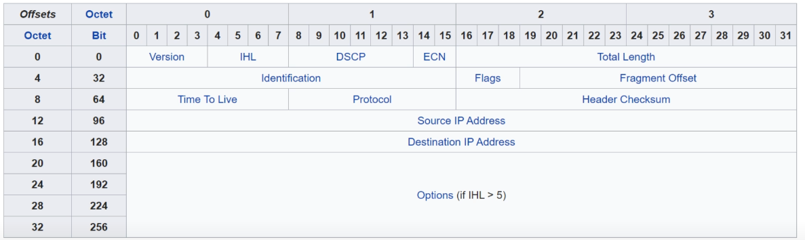

The header is read left to right, top to bottom. Top left being the first bit and bottom right being the last bit in the header.

* **Version**: Identifies the version of IP used. The IPv4 and IPv6 headers have different structures.
	* Length of 4 bits
	* IPv4 = 4 (0100)
	* IPv6 = 6 (0110)
* **IHL (Internet Header Length)**: The final field of the IPv4 header (Options) is variable in length, so this field is necessary to indicate the total length of the header.
	* Length of 4 bits.
	* Identifies the length of the header in 4-byte increments. A value of 5 means the size is 20 bytes.

