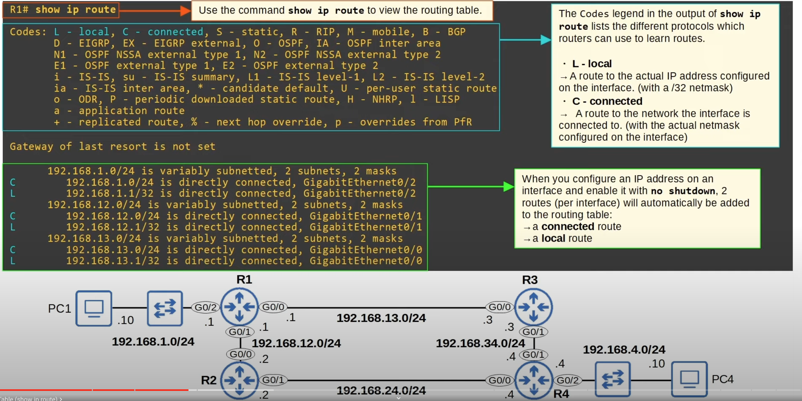
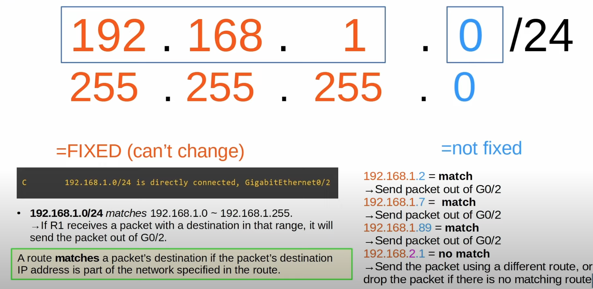
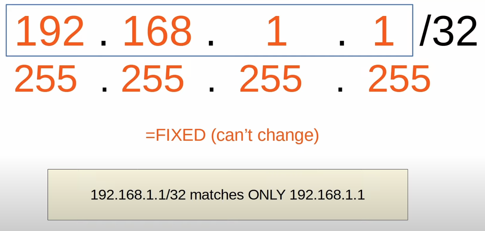

## What is Routing ?
Routing is the process that routers use to determine the path that IP packets should take over a network to reach their destination.
* Routers store routes to all of their known destinations in a **routing table**. 
* When routers receive packets, they look in the routing table to find the best route to forward the packet.

## Routes Learning Mechanism
* **Dynamic Routing**: Routers use dynamic routing protocols (ie. OSPF) to share routing information with each other automatically and build their routing tables.
* **Static Routing**: A network engineer/admin manually configures routes on the router.

## Where Do Routers Send Packages ?
* Packages are sent to the **next-hop** (the next router in the path to the destination) when the router is not directly connected to the destination network.
* Packages are sent to the destination device when the router is directly connected to the destination network (**Connected Route**).
* Routers keep packages when the destination is the router's IP address (**Local Route**).

## Routing Table

The **connected** and **local** routes are neither static nor dynamic routes. They are added automatically when an interface is configured with an IP address and enabled (no shutdown).

#### Connected Routes

* A connected route is a route to the network the interface is connected to.
* R1 G0/2 IP = 192.168.1.1/24
* Network Address = 192.168.1.0/24
* It provides a route to all hosts in that network (ie. 192.168.1.10, 192.168.1.232, etc.)
* R1 knows: "if I need to send a packet to any host in the 192.168.1.0/24 network, I should send it out of G0/2 interface."
#### Local Routes

* A local route is a route to the exact IP address configure on the interface.
* A /32 netmask is used to specify the exact IP address of the interface. It means all 32 bits are fixed, they can't change.
* Even though R1's G0/2 interface is configured as 192.168.1.1/24, the connected route is to 192.168.1.1/32.
* R1 knows: "If I receive a packet destined for this IP address, the message is for me".

## Route Selection
```
R1# show ip route
	192.168.1.0/24 is variably subnetted, 2 subnets, 2 masks
C      192.168.1.0/24 is directly connected, GigabitEthernet0/2
L      192.168.1.1/32 is directly connected, GigabitEthernet0/2
```
* A packet destined for 192.168.1.1 is matched by both routes:
	* 192.168.1.0/24
	* 192.168.1.1/32
* Which route will R1 use for a packet destined for 192.168.1.1 ?
	* It will choose **most specific** matching route.
* The route 192.168.1.0/24 includes 256 different IP addresses (192.168.1.0 - 192.168.1.255)
* The route to 192.168.1.1/32 includes only 1 IP address (192.168.1.1)
* **Most specific** matching route is the **matching route** with the **longest prefix length**.
	* When R1 receives a packet destined for 192.168.1.1, it will select the route to 192.168.1.1/32. It will receive the packet for itself, rather than forward it out of G0/2 (Local Route).
	* This is different than switches, which look for an exact match int he MAC address table to forward frames.

#### What Does The Following Mean ?
`192.168.1.0/24 is variably subnetted, 2 subnets, 2 masks`

These are not routes. They mean the following:
* In the routing table, there are two routes to subnets that fit within the 192.168.1.0/24 class C network, with two different netmasks (/24 and /32).
