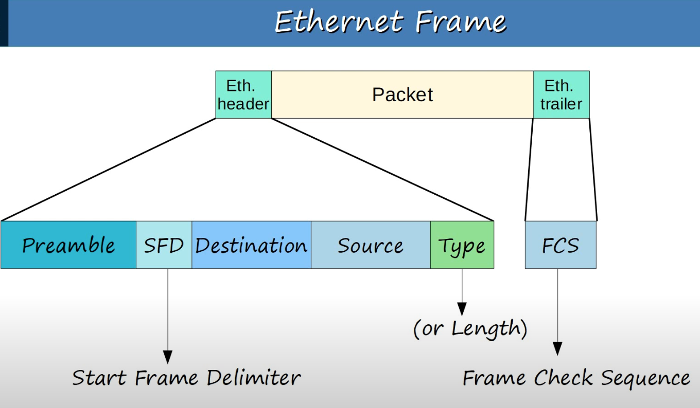

## Ethernet Frame

**The size of ethernet frames is 26 bytes (header + trailer)**
#### Preamble
* 7 bytes (56 bits) field length.
* Alternating 1's and 0's.
	* 10101010 * 7
* Allows devices to synchronize their receiver clocks.
#### SFD (Start Frame Delimiter)
* 1 byte (8 bits) field length.
* Alternating 1's and 0's.
	* 10101011
* Marks the end of the preamble and the beginning of the rest of the frame.
#### Destination/Source
* 6 bytes (48 bits) field length
* Indicate the device sending and receiving the frame.
* Consist of the destination and source `MAC(Media Access Control) address`.
	* Address of the physical device.
#### Type/Length
* 2 bytes (16 bits) field length.
* A value of `1500 or less` in this field indicates the `length` of the encapsulated packet (in bytes).
* A value of `1536 or greater` in this field indicates the `type` of the encapsulated packet (usually IPv4 or IPv6, ARP, etc...) and length is determined via other methods.
* `IPv4`: 0x0800 hexadecimal and 2048 in decimal.
* `IPv6`: 0x86DD hexadecimal and 34525 decimal. 
* `ARP`: 0x0806 hexadecimal
#### FCS (Frame Check Sequence)
* 4 bytes (32 bits) field length.
* Detects corrupted data by running a `CRC(Cyclic Redundancy Check)` algorithm over the received data.

#### NOTE On Ethernet Frame Heaer Structure
* The `Preamble + SFD` might not be included as part of the Ethernet frame header depending on how you define it.
	* Therefore, the size of the Ethernet header + trailer could be 18 bytes (6+ 6 + 2 + 4) rather than 26 bytes.
#### Ethernet Frame Minimum Size
* The minimum size for an Ethernet frame (`Header` + `Payload[Packet]` + `Trailer`) is 64 bytes.
* The minimum payload (packet) size is 46 bytes.
	* 64 bytes - 18 bytes (header + trailer) = 46 bytes.
	* Padding bytes in the form of 0s (hexadecimal) are added when the payload size is less than 46 bytes.
		* ie. 34-byte packet + 12-byte padding = 46 bytes.

## MAC Address
* 6-byte (48 bits) physical address assigned to the device when it is made.
* A.K.A `Burned-In Address(BIA)`
* It is globally unique.
* Written as 12 hexadecimals characters.
* The first 3 bytes are OUI (Organizationally Unique Identifier), which is assigned to the company making the device.
* The last 3 bytes are unique to the device itself.

## Switch Functionality
* Switches `learn`, `flood`, and `fordward` packets
	* **Learn**
		* Switches dynamically learn MAC addresses when a new frame arrives. The association between the source MAC address of the packet and the interface that it came is is written to the switch's `MAC Address Table`.
		* `Aging`: Associations in a switch's MAC address table are removed after 5 minutes of inactivity.
		* `Dynamic MAC address` is an address that is learned automatically by the switch.
	* **Flood**
		* `Unknown unicast frames` are flooded out all interfaces except the one where it came.
		* `Broadcast frames` are flooded out all interfaces except the one where it came.
	* **Fordward**
		* `Known unicast frames` are forwarded out the switch interface associated with the destination MAC address.

## ARP (Address Resolution Protocol)
When looking to initiate communication with another host, we often only know the IP address or domain name of the target device. However, the MAC address of the target or next hop device is also required. ARP is the protocol used to discover the Layer 2 address (MAC address) of a know Layer 3 address (IP address).
* ARP Request
	* The request is broadcast and includes the following properties
		* Source IP address
		* Destination IP address
		* Source MAC address
		* Destination MAC address with FFFF.FFFF.FFFF (broadcast address).
	* Upon arrival to the destination, the target host will add the information from the source host to its ARP table, enabling a unicast reply.
* ARP Reply
	* The reply is unicast and includes the following properties
		* Source IP address
		* Destination IP address
		* Source MAC address
		* Destination MAC address.
	* Upon Arrival to the destination, the MAC address + IP address information from the target host will be used to populate an entry in the ARP table.

#### ARP Record Types
* **Type static**
	* Default entry
* **Type dynamic**
	* Learned via ARP

## Witch MAC Address Table Commands

#### Display MAC Address From Switch
`SW1#show mac address-table`
* Indicates the Vlan.
* Indicates the MAC Address.
* Indicates the Type.
* Indicates the Ports/Interfaces associated with the given MAC address.

#### Remove MAC Address From Switch
* Clear all dynamic MAC addresses
	* `SW1#clear mac address-table dynamic`
* Clear dynamic MAC address with given address
	* `SW1#clear mac address-table dynamic address <mac-address>`
* Clear dynamic MAC addresses associated with given switch port/interface
	* `SW1#clear mac address-table dynamic interface Gi0/0`

