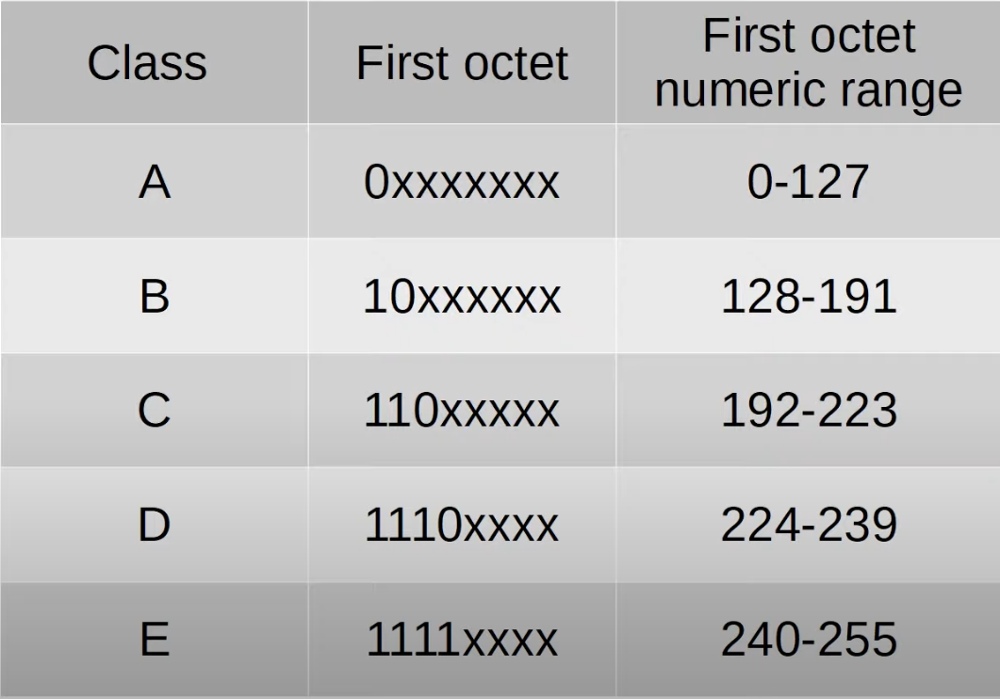

IPv4 addressing operates in the 3rd layer of the OSI model stack - the Network layer.
* Provides connectivity between end hosts on different networks (ie. outside of the LAN).
* Provides logical addressing (IP addressing).
* Provides path selection between source and destination.
* Routes operate at Layer 3.

## IPv4 Address Classes
IPv4 addresses are divided into five different classes. The class of the IPv4 address is determined by the first octet of the IP address.

The non "x" values in the first IP octet indicate the first possible IP address for the given IPv4 address class. Setting all remaining "x"s to 1 indicate the last possible IP address for the given class. Therefore, all addresses between the first and last possible addresses are available for use.

* IPv4 class D addresses are multicast addresses.
* IPv4 class E addresses are Reserved (experimental purposes).
* For class A IPv4 addresses, the last possible address is 126 instead of 127. The 127 address range is reserved for Lookback addresses.
	* The address range is 127.0.0.0 - 127.255.255.255.
	* It is used to test the 'network stack' (OSI, TCP/IP model) on the local device.
	* When a host sends network traffic in the mentioned address range, the traffic is simply processed back up the network model stack.

* The number of assignable addresses per network is subtracted by 2. Therefore, the assignable addresses in a network are in the range of 1 - 254.
	* The first address (0) in the network is reserved for the network address, denoted by all host bits set to 0.
	* The last address (255) in the network is reserved for the broadcast address, denoted by all host bits set to 1.
