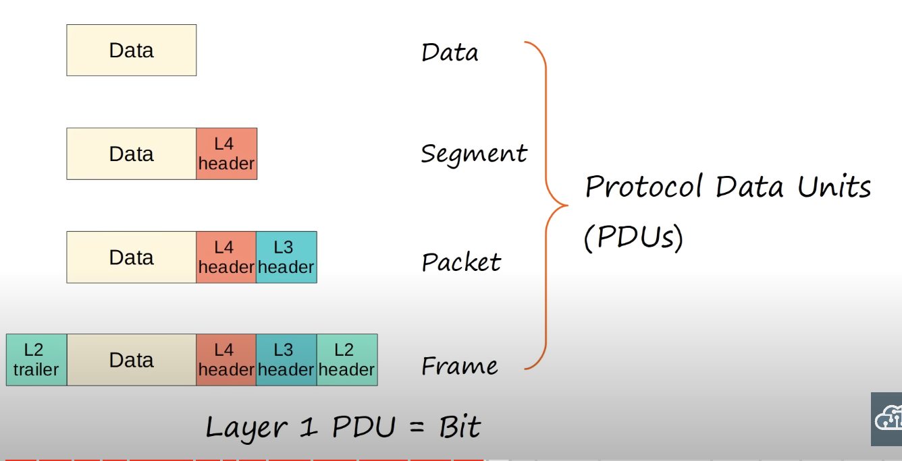

**What is a networking model**?  Networking models categorize and provide a structure for networking protocols and standards.

## OSI (Open Systems Interconnection) Model
**Application Layer**
* Layer closes to the end user.
* Interacts with software applications. 
* It identifies communication partners.
* It synchronizes communication.
* provides process-to-process communication
**Presentation**
* Data in the application layer is in 'application format'. It needs to be translated to a different format to be sent over the network.
* The presentations layers's job is to translate between application and network formats.
* For example, encryption of data as it is sent, and description of data as it is received.
* Also translates between different application layer formats.
**Session**
* Controls sessions between communicating hosts.
* Establishes, manages, and terminates connections between the local application and the remote application.
**Transport**
* Segments and resembles data for communication between end hosts.
* Breaks large pieces of data into smaller segments which can be more easily sent over the network and are less likely to cause transmission problems if errors occur.
* Proves host-to-host communication.
**Network**
* Provides connectivity between hosts on different networks.
* Proves logical addressing (IP addresses).
* Provides path selection between source and destination.
* Routers operate at layer 3.
**Data Link**
* Provides node-to-node connectivity and data transfer.
* Defines how data is formatted for transmission over a physical medium ( for example, copper UTP cables)
* Detects and possibly corrects physical layer errors.
* Uses Layer 2 addressing, separate from Layer 3 addressing.
* Switches operate at Layer 2.
**Physical**
* Defines physical characteristics of the medium used to transfer data between devices.
* Digital bits are converted into electrical (for wired connections) or radio (for wireless connections) signals.

**OSI Model PDUs**

**OSI vs TCP/IP**

